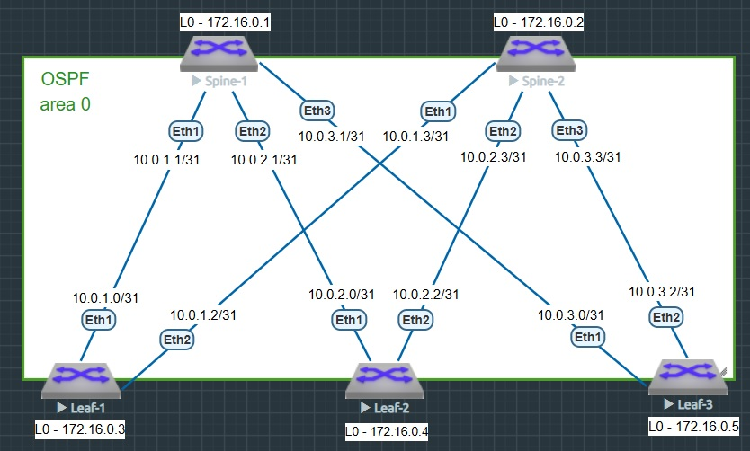

### Построение Underlay сети (OSPF)

### Цель
- настроить OSPF для Underlay сети..

### Схема стенда



### Таблица IP-адресов Loopback-ов

|Device|Interface|IP Address|
|---|---|---|
Spine-1|loopback 0|172.16.0.1/32
Spine-2|loopback 0|172.16.0.2/32
Leaf-1|loopback 0|172.16.0.3/32
Leaf-2|loopback 0|172.16.0.4/32
Leaf-3|loopback 0|172.16.0.5/32

### Таблица IP-адресов P2P-сетей

|Линк|IP Лифа|IP Спайна|Подсеть /31|
|---|---|---|---|
Leaf-1 → Spine-1|10.0.1.0/31|10.0.1.1/31|10.0.1.0/31
Leaf-1 → Spine-2|10.0.1.2/31|10.0.1.3/31|10.0.1.2/31

|Линк|IP Лифа|IP Спайна|Подсеть /31|
|---|---|---|---|
Leaf-2 → Spine-1|10.0.2.0/31|10.0.2.1/31|10.0.2.0/31
Leaf-2 → Spine-2|10.0.2.2/31|10.0.2.3/31|10.0.2.2/31

|Линк|IP Лифа|IP Спайна|Подсеть /31|
|---|---|---|---|
Leaf-3 → Spine-1|10.0.3.0/31|10.0.3.1/31|10.0.3.0/31
Leaf-3 → Spine-2|10.0.3.2/31|10.0.3.3/31|10.0.3.2/31

### Проверка IP-связности между интерфейсами Loopback 0
#### Leaf-1
```
Leaf-1#show ip route 
 C        10.0.1.0/31 is directly connected, Ethernet1
 C        10.0.1.2/31 is directly connected, Ethernet2
 B I      172.16.0.1/32 [200/0] via 10.0.1.1, Ethernet1
 B I      172.16.0.2/32 [200/0] via 10.0.1.3, Ethernet2
 C        172.16.0.3/32 is directly connected, Loopback0
 B I      172.16.0.4/32 [200/0] via 10.0.1.1, Ethernet1
                                via 10.0.1.3, Ethernet2
 B I      172.16.0.5/32 [200/0] via 10.0.1.1, Ethernet1
                                via 10.0.1.3, Ethernet2
```

<details>
<summary> Проверка доступности Spine-1 </summary>

```
Leaf-1#ping 172.16.0.1 source loopback 0
PING 172.16.0.1 (172.16.0.1) from 172.16.0.3 : 72(100) bytes of data.
80 bytes from 172.16.0.1: icmp_seq=1 ttl=64 time=8.96 ms
80 bytes from 172.16.0.1: icmp_seq=2 ttl=64 time=11.9 ms
80 bytes from 172.16.0.1: icmp_seq=3 ttl=64 time=11.7 ms
80 bytes from 172.16.0.1: icmp_seq=4 ttl=64 time=8.79 ms
80 bytes from 172.16.0.1: icmp_seq=5 ttl=64 time=11.2 ms

--- 172.16.0.1 ping statistics ---
5 packets transmitted, 5 received, 0% packet loss, time 47ms
rtt min/avg/max/mdev = 8.790/10.529/11.912/1.370 ms, pipe 2, ipg/ewma 11.992/9.744 ms
```
</details>
<details>
<summary> Проверка доступности Spine-2 </summary>

```
Leaf-1#ping 172.16.0.2 source loopback 0
PING 172.16.0.2 (172.16.0.2) from 172.16.0.3 : 72(100) bytes of data.
80 bytes from 172.16.0.2: icmp_seq=1 ttl=64 time=9.68 ms
80 bytes from 172.16.0.2: icmp_seq=2 ttl=64 time=7.26 ms
80 bytes from 172.16.0.2: icmp_seq=3 ttl=64 time=7.73 ms
80 bytes from 172.16.0.2: icmp_seq=4 ttl=64 time=12.0 ms
80 bytes from 172.16.0.2: icmp_seq=5 ttl=64 time=16.8 ms

--- 172.16.0.2 ping statistics ---
5 packets transmitted, 5 received, 0% packet loss, time 44ms
rtt min/avg/max/mdev = 7.262/10.723/16.888/3.515 ms, pipe 2, ipg/ewma 11.054/10.454 ms
```
</details>
<details>
<summary> Проверка доступности Leaf-2 </summary>

```
Leaf-1#ping 172.16.0.4 source loopback 0
PING 172.16.0.4 (172.16.0.4) from 172.16.0.3 : 72(100) bytes of data.
80 bytes from 172.16.0.4: icmp_seq=1 ttl=63 time=31.9 ms
80 bytes from 172.16.0.4: icmp_seq=2 ttl=63 time=31.8 ms
80 bytes from 172.16.0.4: icmp_seq=3 ttl=63 time=29.2 ms
80 bytes from 172.16.0.4: icmp_seq=4 ttl=63 time=17.7 ms
80 bytes from 172.16.0.4: icmp_seq=5 ttl=63 time=18.7 ms

--- 172.16.0.4 ping statistics ---
5 packets transmitted, 5 received, 0% packet loss, time 90ms
rtt min/avg/max/mdev = 17.726/25.909/31.981/6.335 ms, pipe 3, ipg/ewma 22.663/28.496 ms
```
</details>
<details>
<summary> Проверка доступности Leaf-3 </summary>

```
Leaf-1#ping 172.16.0.5 source loopback 0
PING 172.16.0.5 (172.16.0.5) from 172.16.0.3 : 72(100) bytes of data.
80 bytes from 172.16.0.5: icmp_seq=1 ttl=63 time=23.1 ms
80 bytes from 172.16.0.5: icmp_seq=2 ttl=63 time=25.5 ms
80 bytes from 172.16.0.5: icmp_seq=3 ttl=63 time=22.1 ms
80 bytes from 172.16.0.5: icmp_seq=4 ttl=63 time=68.4 ms
80 bytes from 172.16.0.5: icmp_seq=5 ttl=63 time=34.5 ms

--- 172.16.0.5 ping statistics ---
5 packets transmitted, 5 received, 0% packet loss, time 119ms
rtt min/avg/max/mdev = 22.109/34.750/68.421/17.395 ms, pipe 2, ipg/ewma 29.755/29.625 ms
```
</details>
