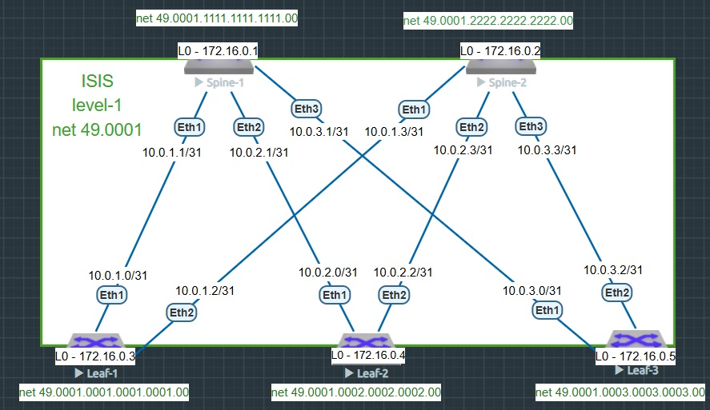

### Построение Underlay сети (ISIS)

### Цель
- настроить IS-IS для Underlay сети.

### Схема стенда



### Таблица IP-адресов Loopback-ов

|Device|Interface|IP Address|
|---|---|---|
Spine-1|loopback 0|172.16.0.1/32
Spine-2|loopback 0|172.16.0.2/32
Leaf-1|loopback 0|172.16.0.3/32
Leaf-2|loopback 0|172.16.0.4/32
Leaf-3|loopback 0|172.16.0.5/32

### Таблица IP-адресов P2P-сетей

|Линк|IP Лифа|IP Спайна|Подсеть /31|
|---|---|---|---|
Leaf-1 → Spine-1|10.0.1.0/31|10.0.1.1/31|10.0.1.0/31
Leaf-1 → Spine-2|10.0.1.2/31|10.0.1.3/31|10.0.1.2/31

|Линк|IP Лифа|IP Спайна|Подсеть /31|
|---|---|---|---|
Leaf-2 → Spine-1|10.0.2.0/31|10.0.2.1/31|10.0.2.0/31
Leaf-2 → Spine-2|10.0.2.2/31|10.0.2.3/31|10.0.2.2/31

|Линк|IP Лифа|IP Спайна|Подсеть /31|
|---|---|---|---|
Leaf-3 → Spine-1|10.0.3.0/31|10.0.3.1/31|10.0.3.0/31
Leaf-3 → Spine-2|10.0.3.2/31|10.0.3.3/31|10.0.3.2/31

### Настройка ISIS
<details>
<summary> Spine-1 </summary>

```
hostname Spine-1
!
interface Ethernet1
   description to-Leaf-1
   mtu 9000
   no switchport
   ip address 10.0.1.1/31
   isis enable UNDERLAY
   isis circuit-type level-1
   isis network point-to-point
!
interface Ethernet2
   description to-Leaf-2
   mtu 9000
   no switchport
   ip address 10.0.2.1/31
   isis enable UNDERLAY
   isis circuit-type level-1
   isis network point-to-point
!
interface Ethernet3
   description to-Leaf-3
   mtu 9000
   no switchport
   ip address 10.0.3.1/31
   isis enable UNDERLAY
   isis circuit-type level-1
   isis network point-to-point
!
interface Loopback0
   description Router-ID
   ip address 172.16.0.1/32
   isis enable UNDERLAY
   isis passive
!
ip routing
!
router isis UNDERLAY
   net 49.0001.1111.1111.1111.00
   !
   address-family ipv4 unicast
!
end
```
</details>
<details>
<summary> Spine-2 </summary>

```
hostname Spine-2
!
interface Ethernet1
   description to-Leaf-1
   mtu 9000
   no switchport
   ip address 10.0.1.3/31
   isis enable UNDERLAY
   isis circuit-type level-1
   isis network point-to-point
!
interface Ethernet2
   description to-Leaf-2
   mtu 9000
   no switchport
   ip address 10.0.2.3/31
   isis enable UNDERLAY
   isis circuit-type level-1
   isis network point-to-point
!
interface Ethernet3
   description to-Leaf-3
   mtu 9000
   no switchport
   ip address 10.0.3.3/31
   isis enable UNDERLAY
   isis circuit-type level-1
   isis network point-to-point
!
interface Loopback0
   description Router-ID
   ip address 172.16.0.2/32
   isis enable UNDERLAY
!
ip routing
!
router isis UNDERLAY
   net 49.0001.2222.2222.2222.00
   !
   address-family ipv4 unicast
!
end
```
</details>
<details>
<summary> Leaf-1 </summary>

```
hostname Leaf-1
!
interface Ethernet1
   description to-Spine-1
   mtu 9000
   no switchport
   ip address 10.0.1.0/31
   isis enable UNDERLAY
   isis circuit-type level-1
   isis network point-to-point
!
interface Ethernet2
   description to-Spine-2
   mtu 9000
   no switchport
   ip address 10.0.1.2/31
   isis enable UNDERLAY
   isis circuit-type level-1
!
interface Loopback0
   description Router-ID
   ip address 172.16.0.3/32
   isis enable UNDERLAY
!
ip routing
!
router isis UNDERLAY
   net 49.0001.0001.0001.0001.00
   !
   address-family ipv4 unicast
!
end
```
</details>
<details>
<summary> Leaf-2 </summary>

```
hostname Leaf-2
!
interface Ethernet1
   description to-Spine-1
   mtu 9000
   no switchport
   ip address 10.0.2.0/31
   isis enable UNDERLAY
   isis circuit-type level-1
   isis network point-to-point
!
interface Ethernet2
   description to-Spine-2
   mtu 9000
   no switchport
   ip address 10.0.2.2/31
   isis enable UNDERLAY
   isis circuit-type level-1
   isis network point-to-point
!
interface Loopback0
   description Router-ID
   ip address 172.16.0.4/32
   isis enable UNDERLAY
   isis passive
!
ip routing
!
router isis UNDERLAY
   net 49.0001.0002.0002.0002.00
   !
   address-family ipv4 unicast
!
end
```
</details>
<details>
<summary> Leaf-3 </summary>

```
hostname Leaf-3
!
interface Ethernet1
   description to-Spine-1
   mtu 9000
   no switchport
   ip address 10.0.3.0/31
   isis enable UNDERLAY
   isis circuit-type level-1
   isis network point-to-point
!
interface Ethernet2
   description to-Spine-2
   mtu 9000
   no switchport
   ip address 10.0.3.2/31
   isis enable UNDERLAY
   isis circuit-type level-1
   isis network point-to-point
!
interface Loopback0
   description Router-ID
   ip address 172.16.0.5/32
   isis enable UNDERLAY
   isis passive
!
ip routing
!
router isis UNDERLAY
   net 49.0001.0003.0003.0003.00
   !
   address-family ipv4 unicast
!
end
```
</details>

### Проверка работы протокола ISIS
#### Leaf-1
```
Leaf-1#show ip ospf neighbor 
Neighbor ID     Instance VRF      Pri State                  Dead Time   Address         Interface
172.16.0.1      1        default  0   FULL                   00:00:33    10.0.1.1        Ethernet1
172.16.0.2      1        default  0   FULL                   00:00:33    10.0.1.3        Ethernet2
```
```
Leaf-1#show ip ospf database 
            OSPF Router with ID(172.16.0.3) (Instance ID 1) (VRF default)
                 Router Link States (Area 0.0.0.0)

Link ID         ADV Router      Age         Seq#         Checksum Link count
172.16.0.2      172.16.0.2      252         0x80000008   0x14a4   7
172.16.0.4      172.16.0.4      353         0x80000006   0x6668   5
172.16.0.1      172.16.0.1      253         0x80000008   0xd7ef   7
172.16.0.5      172.16.0.5      253         0x80000005   0x7c1    5
172.16.0.3      172.16.0.3      455         0x80000005   0xc90d   5
```
```
Leaf-1#show ip route ospf
 O        10.0.2.0/31 [110/20] via 10.0.1.1, Ethernet1
 O        10.0.2.2/31 [110/20] via 10.0.1.3, Ethernet2
 O        10.0.3.0/31 [110/20] via 10.0.1.1, Ethernet1
 O        10.0.3.2/31 [110/20] via 10.0.1.3, Ethernet2
 O        172.16.0.1/32 [110/20] via 10.0.1.1, Ethernet1
 O        172.16.0.2/32 [110/20] via 10.0.1.3, Ethernet2
 O        172.16.0.4/32 [110/30] via 10.0.1.1, Ethernet1
                                 via 10.0.1.3, Ethernet2
 O        172.16.0.5/32 [110/30] via 10.0.1.1, Ethernet1
                                 via 10.0.1.3, Ethernet2
```
<details>
<summary> Проверка доступности Spine-1 </summary>

```
Leaf-1#ping 172.16.0.1 source loopback 0
PING 172.16.0.1 (172.16.0.1) from 172.16.0.3 : 72(100) bytes of data.
80 bytes from 172.16.0.1: icmp_seq=1 ttl=64 time=26.6 ms
80 bytes from 172.16.0.1: icmp_seq=2 ttl=64 time=24.0 ms
80 bytes from 172.16.0.1: icmp_seq=3 ttl=64 time=24.3 ms
80 bytes from 172.16.0.1: icmp_seq=4 ttl=64 time=8.39 ms
80 bytes from 172.16.0.1: icmp_seq=5 ttl=64 time=10.5 ms

--- 172.16.0.1 ping statistics ---
5 packets transmitted, 5 received, 0% packet loss, time 82ms
rtt min/avg/max/mdev = 8.391/18.788/26.681/7.708 ms, pipe 3, ipg/ewma 20.727/22.212 ms
```
</details>
<details>
<summary> Проверка доступности Spine-2 </summary>

```
Leaf-1#ping 172.16.0.2 source loopback 0
PING 172.16.0.2 (172.16.0.2) from 172.16.0.3 : 72(100) bytes of data.
80 bytes from 172.16.0.2: icmp_seq=1 ttl=64 time=10.8 ms
80 bytes from 172.16.0.2: icmp_seq=2 ttl=64 time=7.06 ms
80 bytes from 172.16.0.2: icmp_seq=3 ttl=64 time=12.0 ms
80 bytes from 172.16.0.2: icmp_seq=4 ttl=64 time=20.5 ms
80 bytes from 172.16.0.2: icmp_seq=5 ttl=64 time=10.6 ms

--- 172.16.0.2 ping statistics ---
5 packets transmitted, 5 received, 0% packet loss, time 58ms
rtt min/avg/max/mdev = 7.069/12.239/20.573/4.489 ms, pipe 2, ipg/ewma 14.505/11.687 ms
```
</details>
<details>
<summary> Проверка доступности Leaf-2 </summary>

```
Leaf-1#ping 172.16.0.4 source loopback 0
PING 172.16.0.4 (172.16.0.4) from 172.16.0.3 : 72(100) bytes of data.
80 bytes from 172.16.0.4: icmp_seq=1 ttl=63 time=32.8 ms
80 bytes from 172.16.0.4: icmp_seq=2 ttl=63 time=30.2 ms
80 bytes from 172.16.0.4: icmp_seq=3 ttl=63 time=38.6 ms
80 bytes from 172.16.0.4: icmp_seq=4 ttl=63 time=24.7 ms
80 bytes from 172.16.0.4: icmp_seq=5 ttl=63 time=33.9 ms

--- 172.16.0.4 ping statistics ---
5 packets transmitted, 5 received, 0% packet loss, time 121ms
rtt min/avg/max/mdev = 24.700/32.098/38.663/4.590 ms, pipe 2, ipg/ewma 30.349/32.458 ms
```
</details>
<details>
<summary> Проверка доступности Leaf-3 </summary>

```
Leaf-1#ping 172.16.0.5 source loopback 0
PING 172.16.0.5 (172.16.0.5) from 172.16.0.3 : 72(100) bytes of data.
80 bytes from 172.16.0.5: icmp_seq=1 ttl=63 time=29.4 ms
80 bytes from 172.16.0.5: icmp_seq=2 ttl=63 time=32.2 ms
80 bytes from 172.16.0.5: icmp_seq=3 ttl=63 time=27.5 ms
80 bytes from 172.16.0.5: icmp_seq=4 ttl=63 time=18.3 ms
80 bytes from 172.16.0.5: icmp_seq=5 ttl=63 time=22.1 ms

--- 172.16.0.5 ping statistics ---
5 packets transmitted, 5 received, 0% packet loss, time 112ms
rtt min/avg/max/mdev = 18.385/25.933/32.213/5.019 ms, pipe 2, ipg/ewma 28.044/27.363 ms
```
</details>

