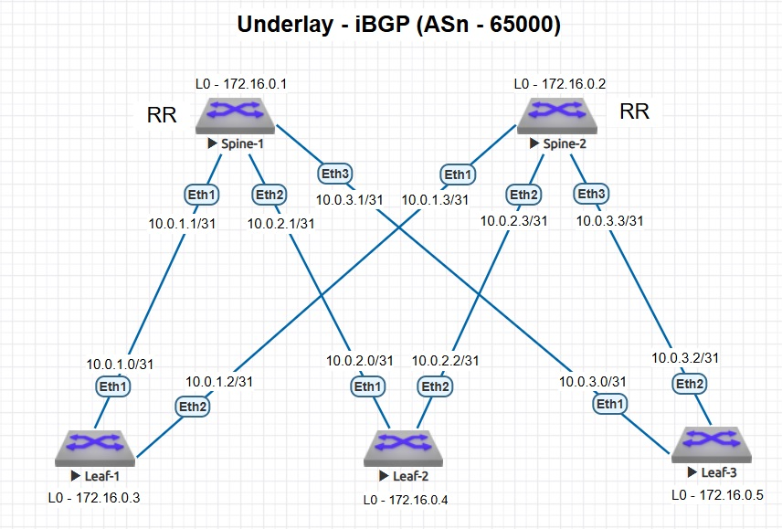

### Построение Underlay сети (iBGP)

### Цели
- настроить iBGP для Underlay сети;
- настроить BFD и аутентификацию для BGP;
- использовать шаблоны при настройке соседства BGP (peer-group).

### Схема стенда



### Описание
Spine выполняют роль RR BGP для пересылки маршрутной информации между Leaf.
На Spine настроен шаблон с автоматическим установлением BGP-соседства с Leaf (пассивное ожидание).
На Leaf настроен шаблон с активным установлением BGP-соседства со Spine.
Дополнительно настроены BFD и аутентификация BGP.
Leaf отправляет маршрутную информацию только о Loopback 0.

### Таблица IP-адресов Loopback-ов

|Device|Interface|IP Address|
|---|---|---|
Spine-1|loopback 0|172.16.0.1/32
Spine-2|loopback 0|172.16.0.2/32
Leaf-1|loopback 0|172.16.0.3/32
Leaf-2|loopback 0|172.16.0.4/32
Leaf-3|loopback 0|172.16.0.5/32

### Таблица IP-адресов P2P-сетей

|Линк|IP Лифа|IP Спайна|Подсеть /31|
|---|---|---|---|
Leaf-1 → Spine-1|10.0.1.0/31|10.0.1.1/31|10.0.1.0/31
Leaf-1 → Spine-2|10.0.1.2/31|10.0.1.3/31|10.0.1.2/31

|Линк|IP Лифа|IP Спайна|Подсеть /31|
|---|---|---|---|
Leaf-2 → Spine-1|10.0.2.0/31|10.0.2.1/31|10.0.2.0/31
Leaf-2 → Spine-2|10.0.2.2/31|10.0.2.3/31|10.0.2.2/31

|Линк|IP Лифа|IP Спайна|Подсеть /31|
|---|---|---|---|
Leaf-3 → Spine-1|10.0.3.0/31|10.0.3.1/31|10.0.3.0/31
Leaf-3 → Spine-2|10.0.3.2/31|10.0.3.3/31|10.0.3.2/31

### Настройки нод (iBGP)
<details>
<summary> Spine-1 </summary>

```
hostname Spine-1
!
spanning-tree mode mstp
!
interface Ethernet1
   description to-Leaf-1
   mtu 9000
   no switchport
   ip address 10.0.1.1/31
   bfd interval 100 min-rx 100 multiplier 3
!
interface Ethernet2
   description to-Leaf-2
   mtu 9000
   no switchport
   ip address 10.0.2.1/31
   bfd interval 100 min-rx 100 multiplier 3
!
interface Ethernet3
   description to-Leaf-3
   mtu 9000
   no switchport
   ip address 10.0.3.1/31
   bfd interval 100 min-rx 100 multiplier 3
!
interface Loopback0
   description Router-ID
   ip address 172.16.0.1/32
!
ip routing
!
router bgp 65000
   router-id 172.16.0.1
   no bgp default ipv4-unicast
   maximum-paths 8 ecmp 8
   bgp listen range 10.0.0.0/16 peer-group LEAF remote-as 65000
   neighbor LEAF peer group
   neighbor LEAF remote-as 65000
   neighbor LEAF next-hop-self
   neighbor LEAF bfd
   neighbor LEAF route-reflector-client
   neighbor LEAF password 7 s4fElnmjEqh1WEspe1KhUA==
   !
   address-family ipv4
      neighbor LEAF activate
!
end
```
</details>
<details>
<summary> Spine-2 </summary>

```
hostname Spine-2
!
spanning-tree mode mstp
!
interface Ethernet1
   description to-Leaf-1
   mtu 9000
   no switchport
   ip address 10.0.1.3/31
   bfd interval 100 min-rx 100 multiplier 3
!
interface Ethernet2
   description to-Leaf-2
   mtu 9000
   no switchport
   ip address 10.0.2.3/31
   bfd interval 100 min-rx 100 multiplier 3
!
interface Ethernet3
   description to-Leaf-3
   mtu 9000
   no switchport
   ip address 10.0.3.3/31
   bfd interval 100 min-rx 100 multiplier 3
!
interface Loopback0
   description Router-ID
   ip address 172.16.0.2/32
!
ip routing
!
router bgp 65000
   router-id 172.16.0.2
   no bgp default ipv4-unicast
   maximum-paths 8 ecmp 8
   bgp listen range 10.0.0.0/16 peer-group LEAF remote-as 65000
   neighbor LEAF peer group
   neighbor LEAF remote-as 65000
   neighbor LEAF next-hop-self
   neighbor LEAF bfd
   neighbor LEAF route-reflector-client
   neighbor LEAF password 7 s4fElnmjEqh1WEspe1KhUA==
   !
   address-family ipv4
      neighbor LEAF activate
!
end
```
</details>
<details>
<summary> Leaf-1 </summary>

```
hostname Leaf-1
!
spanning-tree mode mstp
!
interface Ethernet1
   description to-Spine-1
   mtu 9000
   no switchport
   ip address 10.0.1.0/31
   bfd interval 100 min-rx 100 multiplier 3
!
interface Ethernet2
   description to-Spine-2
   mtu 9000
   no switchport
   ip address 10.0.1.2/31
   bfd interval 100 min-rx 100 multiplier 3
!
interface Loopback0
   description Router-ID
   ip address 172.16.0.3/32
!
ip routing
!
route-map REDISTRIBUTE_ONLY_LOOPBACKS permit 10
   match interface Loopback0
!
router bgp 65000
   router-id 172.16.0.3
   no bgp default ipv4-unicast
   maximum-paths 8 ecmp 8
   neighbor SPINE peer group
   neighbor SPINE remote-as 65000
   neighbor SPINE bfd
   neighbor SPINE password 7 p1iGcmS72bggHzKQpAB8dA==
   neighbor 10.0.1.1 peer group SPINE
   neighbor 10.0.1.3 peer group SPINE
   !
   address-family ipv4
      neighbor SPINE activate
      redistribute connected route-map REDISTRIBUTE_ONLY_LOOPBACKS
!
end
```
</details>
<details>
<summary> Leaf-2 </summary>

```
hostname Leaf-2
!
spanning-tree mode mstp
!
interface Ethernet1
   description to-Spine-1
   mtu 9000
   no switchport
   ip address 10.0.2.0/31
   bfd interval 100 min-rx 100 multiplier 3
!
interface Ethernet2
   description to-Spine-2
   mtu 9000
   no switchport
   ip address 10.0.2.2/31
   bfd interval 100 min-rx 100 multiplier 3
!
interface Loopback0
   description Router-ID
   ip address 172.16.0.4/32
!
ip routing
!
route-map REDISTRIBUTE_ONLY_LOOPBACKS permit 10
   match interface Loopback0
!
router bgp 65000
   router-id 172.16.0.4
   no bgp default ipv4-unicast
   maximum-paths 8 ecmp 8
   neighbor SPINE peer group
   neighbor SPINE remote-as 65000
   neighbor SPINE bfd
   neighbor SPINE password 7 p1iGcmS72bggHzKQpAB8dA==
   neighbor 10.0.2.1 peer group SPINE
   neighbor 10.0.2.3 peer group SPINE
   !
   address-family ipv4
      neighbor SPINE activate
      redistribute connected route-map REDISTRIBUTE_ONLY_LOOPBACKS
!
end
```
</details>
<details>
<summary> Leaf-3 </summary>

```
hostname Leaf-3
!
spanning-tree mode mstp
!
interface Ethernet1
   description to-Spine-1
   mtu 9000
   no switchport
   ip address 10.0.3.0/31
   bfd interval 100 min-rx 100 multiplier 3
!
interface Ethernet2
   description to-Spine-2
   mtu 9000
   no switchport
   ip address 10.0.3.2/31
   bfd interval 100 min-rx 100 multiplier 3
!
interface Loopback0
   description Router-ID
   ip address 172.16.0.5/32
!
ip routing
!
route-map REDISTRIBUTE_ONLY_LOOPBACKS permit 10
   match interface Loopback0
!
router bgp 65000
   router-id 172.16.0.5
   no bgp default ipv4-unicast
   maximum-paths 8 ecmp 8
   neighbor SPINE peer group
   neighbor SPINE remote-as 65000
   neighbor SPINE bfd
   neighbor SPINE password 7 p1iGcmS72bggHzKQpAB8dA==
   neighbor 10.0.3.1 peer group SPINE
   neighbor 10.0.3.3 peer group SPINE
   !
   address-family ipv4
      neighbor SPINE activate
      redistribute connected route-map REDISTRIBUTE_ONLY_LOOPBACKS
!
end

```
</details>

### Проверка работы протокола iBGP
#### Leaf-1
```
Leaf-1#show ip bgp summary 
BGP summary information for VRF default
Router identifier 172.16.0.3, local AS number 65000
Neighbor Status Codes: m - Under maintenance
  Neighbor V AS           MsgRcvd   MsgSent  InQ OutQ  Up/Down State   PfxRcd PfxAcc
  10.0.1.1 4 65000             85        80    0    0 00:04:07 Estab   2      2
  10.0.1.3 4 65000             77        75    0    0 00:00:07 Estab   2      2
```
```
Leaf-1#show ip route bgp 

 B I      172.16.0.4/32 [200/0] via 10.0.1.1, Ethernet1
                                via 10.0.1.3, Ethernet2
 B I      172.16.0.5/32 [200/0] via 10.0.1.1, Ethernet1
                                via 10.0.1.3, Ethernet2
```
### Проверка работы протокола BFD
#### Leaf-1
```
Leaf-1#show bfd peers 
VRF name: default
-----------------
DstAddr       MyDisc    YourDisc  Interface/Transport    Type           LastUp 
--------- ----------- ----------- -------------------- ------- ----------------
10.0.1.1  1025628936  1557984869        Ethernet1(14)  normal   08/27/26 13:24 
10.0.1.3   604765614  1187943764        Ethernet2(15)  normal   08/27/26 13:25 

         LastDown            LastDiag    State
-------------------- ------------------- -----
   08/27/26 13:24       No Diagnostic       Up
   08/27/26 13:25       No Diagnostic       Up
```
```
Leaf-1#show ip bgp neighbors bfd
BGP BFD Neighbor Table
Flags: U - BFD is enabled for BGP neighbor and BFD session state is UP
       I - BFD is enabled for BGP neighbor and BFD session state is INIT
       D - BFD is enabled for BGP neighbor and BFD session state is DOWN
       d - BFD damping timer is active
       N - BFD is not enabled for BGP neighbor
Neighbor           Interface          Up/Down    State       Flags
10.0.1.1           Ethernet1          00:00:35   Established U    
10.0.1.3           Ethernet2          00:00:35   Established U    
```

</details>
<details>
<summary> Проверка доступности Leaf-2 </summary>

```
Leaf-1#ping 172.16.0.4 source loopback 0
PING 172.16.0.4 (172.16.0.4) from 172.16.0.3 : 72(100) bytes of data.
80 bytes from 172.16.0.4: icmp_seq=1 ttl=63 time=60.4 ms
80 bytes from 172.16.0.4: icmp_seq=2 ttl=63 time=59.9 ms
80 bytes from 172.16.0.4: icmp_seq=3 ttl=63 time=66.1 ms
80 bytes from 172.16.0.4: icmp_seq=4 ttl=63 time=92.1 ms
80 bytes from 172.16.0.4: icmp_seq=5 ttl=63 time=91.7 ms

--- 172.16.0.4 ping statistics ---
5 packets transmitted, 5 received, 0% packet loss, time 47ms
rtt min/avg/max/mdev = 59.923/74.072/92.155/14.746 ms, pipe 5, ipg/ewma 11.757/68.325 ms

```
</details>
<details>
<summary> Проверка доступности Leaf-3 </summary>

```
Leaf-1#ping 172.16.0.5 source loopback 0
PING 172.16.0.5 (172.16.0.5) from 172.16.0.3 : 72(100) bytes of data.
80 bytes from 172.16.0.5: icmp_seq=1 ttl=63 time=66.3 ms
80 bytes from 172.16.0.5: icmp_seq=2 ttl=63 time=65.9 ms
80 bytes from 172.16.0.5: icmp_seq=3 ttl=63 time=77.0 ms
80 bytes from 172.16.0.5: icmp_seq=4 ttl=63 time=66.6 ms
80 bytes from 172.16.0.5: icmp_seq=5 ttl=63 time=57.5 ms

--- 172.16.0.5 ping statistics ---
5 packets transmitted, 5 received, 0% packet loss, time 55ms
rtt min/avg/max/mdev = 57.523/66.691/77.014/6.194 ms, pipe 5, ipg/ewma 13.866/66.273 ms
