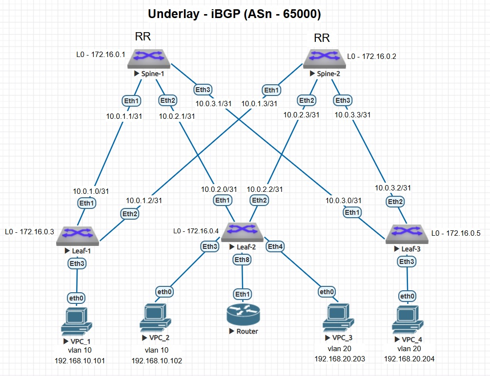

### Настройка маршрутизации в VxLAN EVPN (Bridged Overlay, Router-on-Stick)

### Схема стенда



### Описание
- VxLAN EVPN L2-сеть взята из предыдущей работы - [Lab05. VxLAN EVPN L2](https://github.com/armbot/OTUS/tree/9505106f8681b0b35010acc5577b91d84ab4c4a9/VxLAN/lab05).
- Добавлен элемент Router с функцией маршрутизации между подсетями (Router-on-Stick).
- На Router настроены шлюзы сетей 192.168.10.1 и 192.168.20.1.

### Настройки
<details>
<summary> Leaf-2 </summary>

```
!
interface Ethernet8
   switchport mode trunk
!
```
</details>
<details>
<summary> Router </summary>

```
!
hostname Router
!
vlan 10,20
!
interface Ethernet1
   switchport mode trunk
!
interface Vlan10
   ip address 192.168.10.1/24
!
interface Vlan20
   ip address 192.168.20.1/24
!
ip routing
!
end
```
</details>

### Проверка работы
</details>
<details>
<summary> Проверка доступности VPC_1 (Leaf-1) <-> VPC_3 (Leaf-2) </summary>

```
VPC_1> ping 192.168.20.203

84 bytes from 192.168.20.203 icmp_seq=1 ttl=63 time=254.020 ms
84 bytes from 192.168.20.203 icmp_seq=2 ttl=63 time=55.640 ms
84 bytes from 192.168.20.203 icmp_seq=3 ttl=63 time=67.200 ms
84 bytes from 192.168.20.203 icmp_seq=4 ttl=63 time=67.751 ms
84 bytes from 192.168.20.203 icmp_seq=5 ttl=63 time=81.951 ms

VPC_1> trace 192.168.20.203  
trace to 192.168.20.203, 8 hops max, press Ctrl+C to stop
 1   192.168.10.1   43.572 ms  121.904 ms  47.688 ms
 2   *192.168.20.203   245.482 ms (ICMP type:3, code:3, Destination port unreachable)
```
</details>
<details>
<summary> Проверка доступности VPC_1 (Leaf-1) <-> VPC_4 (Leaf-3) </summary>

```
VPC_1> ping 192.168.20.204

84 bytes from 192.168.20.204 icmp_seq=1 ttl=63 time=246.132 ms
84 bytes from 192.168.20.204 icmp_seq=2 ttl=63 time=101.082 ms
84 bytes from 192.168.20.204 icmp_seq=3 ttl=63 time=88.055 ms
84 bytes from 192.168.20.204 icmp_seq=4 ttl=63 time=87.150 ms
84 bytes from 192.168.20.204 icmp_seq=5 ttl=63 time=198.263 ms

VPC_1> trace 192.168.20.204
trace to 192.168.20.204, 8 hops max, press Ctrl+C to stop
 1   192.168.10.1   53.539 ms  50.057 ms  49.352 ms
 2   *192.168.20.204   239.813 ms (ICMP type:3, code:3, Destination port unreachable)

#### #show bgp evpn route-type mac-ip vni 10010
```
</details>
<details>
<summary> Leaf-1#show bgp evpn route-type mac-ip vni 10010 </summary>

```
Leaf-1#show bgp evpn route-type mac-ip vni 10010
BGP routing table information for VRF default
Router identifier 172.16.0.3, local AS number 65000
Route status codes: * - valid, > - active, S - Stale, E - ECMP head, e - ECMP
                    c - Contributing to ECMP, % - Pending BGP convergence
Origin codes: i - IGP, e - EGP, ? - incomplete
AS Path Attributes: Or-ID - Originator ID, C-LST - Cluster List, LL Nexthop - Link Local Nexthop

          Network                Next Hop              Metric  LocPref Weight  Path
 * >      RD: 172.16.0.3:10 mac-ip 0050.7966.6806
                                 -                     -       -       0       i
 * >      RD: 172.16.0.4:10 mac-ip 0050.7966.6807
                                 172.16.0.4            -       100     0       i
 * >      RD: 172.16.0.4:10 mac-ip 5000.00af.d3f6
                                 172.16.0.4            -       100     0       i
```
</details>
<details>
<summary> Leaf-1#show mac address-table </summary>

```
Leaf-1#show mac address-table
          Mac Address Table
------------------------------------------------------------------

Vlan    Mac Address       Type        Ports      Moves   Last Move
----    -----------       ----        -----      -----   ---------
  10    0050.7966.6806    DYNAMIC     Et3        1       0:00:10 ago
  10    0050.7966.6807    DYNAMIC     Vx1        1       0:00:10 ago
  10    5000.00af.d3f6    DYNAMIC     Vx1        1       0:00:02 ago
```
</details>
