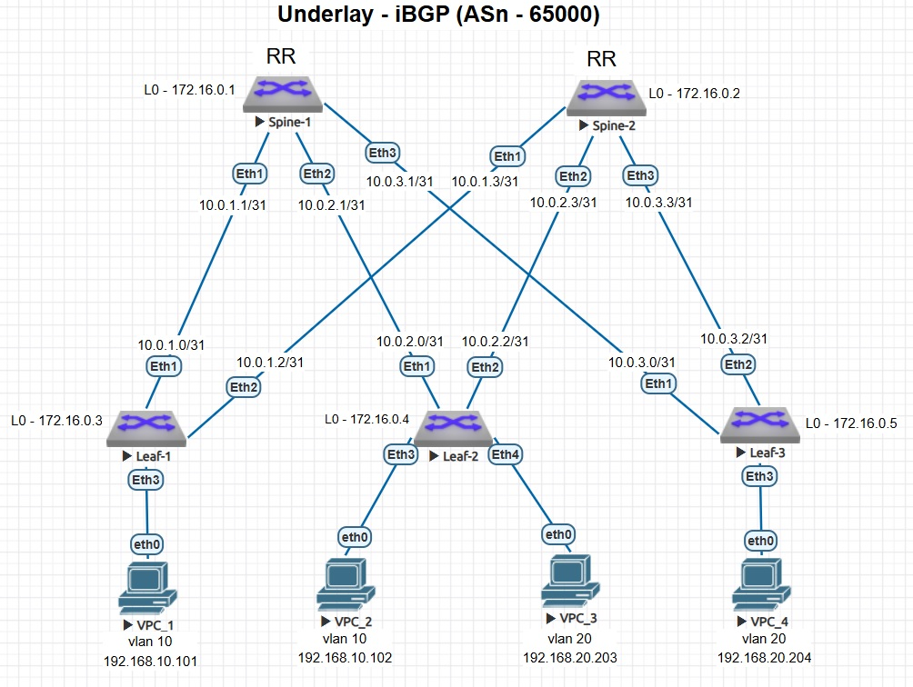

### Настройка маршрутизации в VxLAN EVPN (Edge-Routed Bridging, Symmetric IRB)

### Схема стенда



### Описание
- VxLAN EVPN L2-сеть взята из предыдущей работы - [Lab05. VxLAN EVPN L2](https://github.com/armbot/OTUS/tree/9505106f8681b0b35010acc5577b91d84ab4c4a9/VxLAN/lab05).
- На каждом Leaf производятся идентичные настройки для Symmetric IRB (меняется только rd Loopback:50001).

### Настройки
<details>
<summary> Leaf-1 </summary>

```
!
vrf instance TENANT-A
!
interface Vlan10
   vrf TENANT-A
   ip address virtual 192.168.10.1/24
!
interface Vlan20
   vrf TENANT-A
   ip address virtual 192.168.20.1/24
!
interface Vxlan1
   vxlan vrf TENANT-A vni 50001
!
ip virtual-router mac-address 00:00:22:22:33:33
!
ip routing vrf TENANT-A
!
!
router bgp 65000
   !
   vrf TENANT-A
      rd 172.16.0.3:50001
      route-target import evpn 65000:50001
      route-target export evpn 65000:50001
      redistribute connected
!
```
</details>
<details>
<summary> Leaf-2 </summary>

```
!
vrf instance TENANT-A
!
interface Vlan10
   vrf TENANT-A
   ip address virtual 192.168.10.1/24
!
interface Vlan20
   vrf TENANT-A
   ip address virtual 192.168.20.1/24
!
interface Vxlan1
   vxlan vrf TENANT-A vni 50001
!
ip virtual-router mac-address 00:00:22:22:33:33
!
ip routing vrf TENANT-A
!
!
router bgp 65000
   !
   vrf TENANT-A
      rd 172.16.0.4:50001
      route-target import evpn 65000:50001
      route-target export evpn 65000:50001
      redistribute connected
!
```
</details>
<details>
<summary> Leaf-3 </summary>

```
!
vrf instance TENANT-A
!
interface Vlan10
   vrf TENANT-A
   ip address virtual 192.168.10.1/24
!
interface Vlan20
   vrf TENANT-A
   ip address virtual 192.168.20.1/24
!
interface Vxlan1
   vxlan vrf TENANT-A vni 50001
!
ip virtual-router mac-address 00:00:22:22:33:33
!
ip routing vrf TENANT-A
!
!
router bgp 65000
   !
   vrf TENANT-A
      rd 172.16.0.5:50001
      route-target import evpn 65000:50001
      route-target export evpn 65000:50001
      redistribute connected
!
```
</details>

### Проверка работы
<details>
<summary> Leaf-1#show ip route vrf TENANT-A </summary>

```
Leaf-1#show ip route vrf TENANT-A

VRF: TENANT-A
Codes: C - connected, S - static, K - kernel, 
       O - OSPF, IA - OSPF inter area, E1 - OSPF external type 1...

Gateway of last resort is not set

 C        192.168.10.0/24 is directly connected, Vlan10
 B I      192.168.20.203/32 [200/0] via VTEP 172.16.0.4 VNI 50001 router-mac 50:00:00:03:37:66 local-interface Vxlan1
 B I      192.168.20.204/32 [200/0] via VTEP 172.16.0.5 VNI 50001 router-mac 50:00:00:15:f4:e8 local-interface Vxlan1
 B I      192.168.20.0/24 [200/0] via VTEP 172.16.0.4 VNI 50001 router-mac 50:00:00:03:37:66 local-interface Vxlan1
                                  via VTEP 172.16.0.5 VNI 50001 router-mac 50:00:00:15:f4:e8 local-interface Vxlan1
```
</details>
<details>
<summary> Leaf-1#show bgp evpn route-type ip-prefix ipv4 </summary>

```
Leaf-1#show bgp evpn route-type ip-prefix ipv4
BGP routing table information for VRF default
Router identifier 172.16.0.3, local AS number 65000
Route status codes: * - valid, > - active, S - Stale, E - ECMP head, e - ECMP
                    c - Contributing to ECMP, % - Pending BGP convergence
Origin codes: i - IGP, e - EGP, ? - incomplete
AS Path Attributes: Or-ID - Originator ID, C-LST - Cluster List, LL Nexthop - Link Local Nexthop

          Network                Next Hop              Metric  LocPref Weight  Path
 * >      RD: 172.16.0.3:50001 ip-prefix 192.168.10.0/24
                                 -                     -       -       0       i
 * >      RD: 172.16.0.4:50001 ip-prefix 192.168.10.0/24
                                 172.16.0.4            -       100     0       i
 * >      RD: 172.16.0.4:50001 ip-prefix 192.168.20.0/24
                                 172.16.0.4            -       100     0       i
 * >      RD: 172.16.0.5:50001 ip-prefix 192.168.20.0/24
                                 172.16.0.5            -       100     0       i
```
</details>
</details>
<details>
<summary> Проверка доступности VPC_1 (Leaf-1) <-> VPC_3 (Leaf-2) </summary>

```
VPC_1> ping 192.168.20.203  

84 bytes from 192.168.20.203 icmp_seq=1 ttl=62 time=73.365 ms
84 bytes from 192.168.20.203 icmp_seq=2 ttl=62 time=100.237 ms
84 bytes from 192.168.20.203 icmp_seq=3 ttl=62 time=37.407 ms
84 bytes from 192.168.20.203 icmp_seq=4 ttl=62 time=42.458 ms
84 bytes from 192.168.20.203 icmp_seq=5 ttl=62 time=40.282 ms

VPC_1> trace 192.168.20.203
trace to 192.168.20.203, 8 hops max, press Ctrl+C to stop
 1   192.168.10.1   7.651 ms  7.490 ms  9.355 ms
 2   192.168.10.1   39.109 ms  24.719 ms  29.490 ms
 3   *192.168.20.203   38.096 ms (ICMP type:3, code:3, Destination port unreachable)
```
</details>
<details>
<summary> Проверка доступности VPC_1 (Leaf-1) <-> VPC_4 (Leaf-3) </summary>

```
VPC_1> ping 192.168.20.204 

84 bytes from 192.168.20.204 icmp_seq=1 ttl=62 time=50.378 ms
84 bytes from 192.168.20.204 icmp_seq=2 ttl=62 time=35.326 ms
84 bytes from 192.168.20.204 icmp_seq=3 ttl=62 time=45.327 ms
84 bytes from 192.168.20.204 icmp_seq=4 ttl=62 time=42.364 ms
84 bytes from 192.168.20.204 icmp_seq=5 ttl=62 time=41.609 ms

VPC_1> trace 192.168.20.204  
trace to 192.168.20.204, 8 hops max, press Ctrl+C to stop
 1   192.168.10.1   7.398 ms  9.612 ms  8.528 ms
 2   192.168.20.1   40.143 ms  27.631 ms  26.709 ms
 3   *192.168.20.204   48.012 ms (ICMP type:3, code:3, Destination port unreachable)
```
</details>
