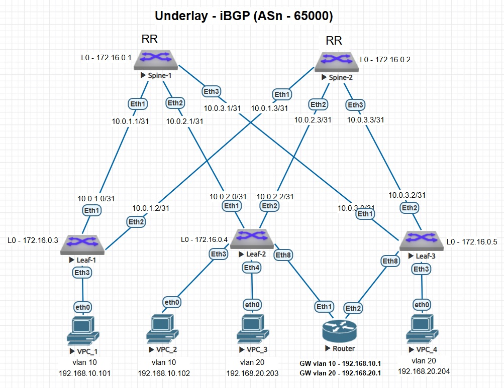

### Настройка Multihoming в VxLAN EVPN

### Схема стенда



### Описание
- VxLAN EVPN L2-сеть взята из работы - [Lab05. VxLAN EVPN L2](https://github.com/armbot/OTUS/tree/9505106f8681b0b35010acc5577b91d84ab4c4a9/VxLAN/lab05).
- Добавлен элемент Router с функцией маршрутизации между подсетями (Router-on-Stick). Интерфейсы Router объединяются в Port-Channel (LACP).
- На Leaf-2 И Leaf-3 настраивается Multihoming для поддержки работы Port-Channel до Router.
- Дополнительно на Leaf-2 и Leaf-3 настраивается Link Tracking для верной работы отказоустойчивости.

### Настройки
<details>
<summary> Router </summary>

```
!
vlan 10,20
!
interface Port-Channel1
   switchport mode trunk
!
interface Ethernet1
   switchport mode trunk
   channel-group 1 mode active
!
interface Ethernet2
   switchport mode trunk
   channel-group 1 mode active
!
interface Vlan10
   ip address 192.168.10.1/24
!
interface Vlan20
   ip address 192.168.20.1/24
!
ip routing
```
</details>
<details>
<summary> Leaf-2 </summary>

```
!
interface Port-Channel1
   switchport mode trunk
   !
   evpn ethernet-segment
      identifier 0000:0000:0000:0000:0001
      designated-forwarder election algorithm preference 20
      route-target import 00:00:00:00:00:01
   lacp system-id 1111.2222.3333
!
interface Ethernet8
   switchport mode trunk
   channel-group 1 mode active
!
```
</details>
<details>
<summary> Leaf-3 </summary>

```
!
interface Port-Channel1
   description TO_Router
   switchport mode trunk
   !
   evpn ethernet-segment
      identifier 0000:0000:0000:0000:0001
      designated-forwarder election algorithm preference 50
      route-target import 00:00:00:00:00:01
   lacp system-id 1111.2222.3333
!
interface Ethernet8
   switchport mode trunk
   channel-group 1 mode active
!
```
</details>

#### Дополнительно Link Tracking:
<details>
<summary> Leaf-2 и Leaf-3 </summary>

```
!
link tracking group CORE-TRACKING
   recovery delay 1
!
interface Ethernet1
   description to-Spine-1
   link tracking group CORE-TRACKING upstream
!
interface Ethernet2
   description to-Spine-2
   link tracking group CORE-TRACKING upstream
!
interface Ethernet8
   description TO_Router
   link tracking group CORE-TRACKING downstream
!
```
</details>

### Проверка работы
#### Router:
<details>
<summary> #show port-channel 1 detailed </summary>

```
Router#show port-channel 1 detailed 
Port Channel Port-Channel1 (Fallback State: Unconfigured):
Minimum links: unconfigured
Minimum speed: unconfigured
Current weight/Max weight: 2/16
  Active Ports:
       Port            Time Became Active       Protocol       Mode      Weight
    --------------- ------------------------ -------------- ------------ ------
       Ethernet1       15:57:38                 LACP           Active      1   
       Ethernet2       16:07:56                 LACP           Active      1   
```
</details>
<details>
<summary> #show mac address-table </summary>

```
Router#show mac address-table 
          Mac Address Table
------------------------------------------------------------------

Vlan    Mac Address       Type        Ports      Moves   Last Move
----    -----------       ----        -----      -----   ---------
  10    0050.7966.6806    DYNAMIC     Po1        1       0:00:48 ago
  20    0050.7966.6808    DYNAMIC     Po1        1       0:00:48 ago
  20    0050.7966.6809    DYNAMIC     Po1        1       0:00:29 ago
Total Mac Addresses for this criterion: 3

          Multicast Mac Address Table
------------------------------------------------------------------

Vlan    Mac Address       Type        Ports
----    -----------       ----        -----
Total Mac Addresses for this criterion: 0
```
</details>
<details>
<summary> #show arp </summary>

```
Router#show arp
Address         Age (sec)  Hardware Addr   Interface
192.168.10.101    0:01:00  0050.7966.6806  Vlan10, Port-Channel1
192.168.20.203    0:00:59  0050.7966.6808  Vlan20, Port-Channel1
192.168.20.204    0:00:41  0050.7966.6809  Vlan20, Port-Channel1
```
</details>

#### Leaf-2:
<details>
<summary> #show lacp peer </summary>

```
Leaf-2#show lacp peer 
State: A = Active, P = Passive; S=ShortTimeout, L=LongTimeout;
       G = Aggregable, I = Individual; s+=InSync, s-=OutOfSync;
       C = Collecting, X = state machine expired,
       D = Distributing, d = default neighbor state
                 |                        Partner                              
 Port    Status  | Sys-id                    Port#   State     OperKey  PortPri
------ ----------|------------------------- ------- --------- --------- -------
Port Channel Port-Channel1:                                            
 Et8     Bundled | 8000,50-00-00-af-d3-f6        1   ALGs+CD    0x0001    32768
```
</details>
<details>
<summary> #show bgp evpn route-type ethernet-segment </summary>

```
Leaf-2#show bgp evpn route-type ethernet-segment 
BGP routing table information for VRF default
Router identifier 172.16.0.4, local AS number 65000
Route status codes: * - valid, > - active, S - Stale, E - ECMP head, e - ECMP
                    c - Contributing to ECMP, % - Pending BGP convergence
Origin codes: i - IGP, e - EGP, ? - incomplete
AS Path Attributes: Or-ID - Originator ID, C-LST - Cluster List, LL Nexthop - Link Local Nexthop

          Network                Next Hop              Metric  LocPref Weight  Path
 * >      RD: 172.16.0.4:1 ethernet-segment 0000:0000:0000:0000:0001 172.16.0.4
                                 -                     -       -       0       i
 * >      RD: 172.16.0.5:1 ethernet-segment 0000:0000:0000:0000:0001 172.16.0.5
                                 172.16.0.5            -       100     0       i
```
</details>
<details>
<summary> #show bgp evpn route-type auto-discovery  </summary>

```
Leaf-2#show bgp evpn route-type auto-discovery 
BGP routing table information for VRF default
Router identifier 172.16.0.4, local AS number 65000
Route status codes: * - valid, > - active, S - Stale, E - ECMP head, e - ECMP
                    c - Contributing to ECMP, % - Pending BGP convergence
Origin codes: i - IGP, e - EGP, ? - incomplete
AS Path Attributes: Or-ID - Originator ID, C-LST - Cluster List, LL Nexthop - Link Local Nexthop

          Network                Next Hop              Metric  LocPref Weight  Path
 * >      RD: 172.16.0.4:10 auto-discovery 0 0000:0000:0000:0000:0001
                                 -                     -       -       0       i
 * >      RD: 172.16.0.4:20 auto-discovery 0 0000:0000:0000:0000:0001
                                 -                     -       -       0       i
 * >      RD: 172.16.0.5:10 auto-discovery 0 0000:0000:0000:0000:0001
                                 172.16.0.5            -       100     0       i
 * >      RD: 172.16.0.5:20 auto-discovery 0 0000:0000:0000:0000:0001
                                 172.16.0.5            -       100     0       i
 * >      RD: 172.16.0.4:1 auto-discovery 0000:0000:0000:0000:0001
                                 -                     -       -       0       i
 * >      RD: 172.16.0.5:1 auto-discovery 0000:0000:0000:0000:0001
                                 172.16.0.5            -       100     0       i
```
</details>

#### Проверка доступности
<details>
<summary> Проверка доступности VPC_1 (Leaf-1) <-> VPC_3 (Leaf-2) </summary>

```
VPC_1> ping 192.168.20.203

84 bytes from 192.168.20.203 icmp_seq=1 ttl=63 time=388.310 ms
84 bytes from 192.168.20.203 icmp_seq=2 ttl=63 time=104.637 ms
84 bytes from 192.168.20.203 icmp_seq=3 ttl=63 time=93.899 ms
84 bytes from 192.168.20.203 icmp_seq=4 ttl=63 time=123.798 ms
84 bytes from 192.168.20.203 icmp_seq=5 ttl=63 time=132.093 ms

VPC_1> trace 192.168.20.203
trace to 192.168.20.203, 8 hops max, press Ctrl+C to stop
 1   192.168.10.1   154.114 ms  43.765 ms  47.044 ms
 2   *192.168.20.203   89.347 ms (ICMP type:3, code:3, Destination port unreachable)
```
</details>
<details>
<summary> Проверка доступности VPC_1 (Leaf-1) <-> VPC_4 (Leaf-3) </summary>

```
VPC_1> ping 192.168.20.204 

84 bytes from 192.168.20.204 icmp_seq=1 ttl=63 time=202.226 ms
84 bytes from 192.168.20.204 icmp_seq=2 ttl=63 time=104.506 ms
84 bytes from 192.168.20.204 icmp_seq=3 ttl=63 time=110.643 ms
84 bytes from 192.168.20.204 icmp_seq=4 ttl=63 time=112.178 ms
84 bytes from 192.168.20.204 icmp_seq=5 ttl=63 time=69.128 ms

VPC_1> trace 192.168.20.204
trace to 192.168.20.204, 8 hops max, press Ctrl+C to stop
 1   192.168.10.1   55.492 ms  48.689 ms  50.845 ms
 2   *192.168.20.204   81.738 ms (ICMP type:3, code:3, Destination port unreachable)
```
</details>
